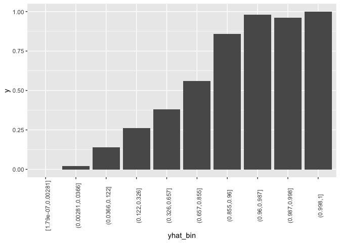

<!-- README.md is generated from README.Rmd. Please edit that file -->

# add2evaluation

<!-- badges: start -->

[](https://zenodo.org/badge/latestdoi/156731270)
<!-- badges: end -->

The goal of add2evaluation is to help save time to train model and get
prediction in this
[contest](www.dcjingsai.com/common/cmpt/国能日新光伏功率预测大赛_竞赛信息.html).
Now I post a discussion
[here](http://www.dcjingsai.com/common/bbs/topicDetails.html?tid=2515).

## Installation

And the development version from [GitHub](https://github.com/) with:

``` r
# install.packages("devtools")
devtools::install_github("JiaxiangBU/add2evaluation")
```

## Example

This is a basic example which shows you how to solve a common problem:

``` r
library(add2evaluation)
library(dplyr)
#> Warning: package 'dplyr' was built under R version 3.5.3
#> 
#> Attaching package: 'dplyr'
#> The following objects are masked from 'package:stats':
#> 
#>     filter, lag
#> The following objects are masked from 'package:base':
#> 
#>     intersect, setdiff, setequal, union
library(ggplot2)
#> Warning: package 'ggplot2' was built under R version 3.5.3
## basic example code
```

See the vignettes.

``` r
lift_chart(add2evaluation::df, bin_number = 10)
```



## Citations

Jiaxiang Li. (2019, August 3). JiaxiangBU/add2evaluation: add2evaluation
0.1.0 (Version v0.1.0). Zenodo. <http://doi.org/10.5281/zenodo.3359660>

``` bibtex
@misc{jiaxiang_li_2019_3359660,
  author       = {Jiaxiang Li},
  title        = {JiaxiangBU/add2evaluation: add2evaluation 0.1.0},
  month        = aug,
  year         = 2019,
  doi          = {10.5281/zenodo.3359660},
  url          = {https://doi.org/10.5281/zenodo.3359660}
}
```

If you use add2evaluation, I would be very grateful if you can add a
citation in your published work. By citing add2evaluation, beyond
acknowledging the work, you contribute to make it more visible and
guarantee its growing and sustainability. For citation, please use the
BibTex or the citation content.

-----

<h4 align="center">

**Code of Conduct**

</h4>

<h6 align="center">

Please note that the `add2evaluation` project is released with a
[Contributor Code of Conduct](.github/CODE_OF_CONDUCT.md).<br>By
contributing to this project, you agree to abide by its terms.

</h6>

<h4 align="center">

**License**

</h4>

<h6 align="center">

MIT © [Jiaxiang Li](LICENSE.md)

</h6>
